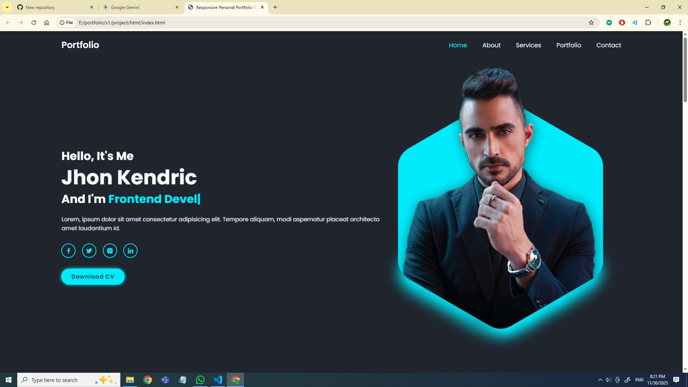
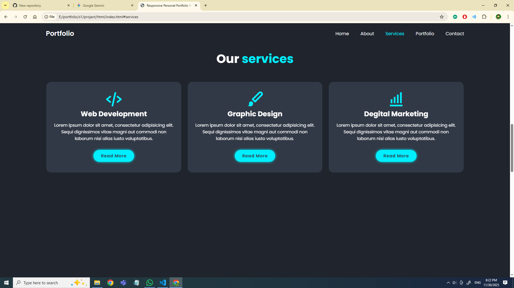
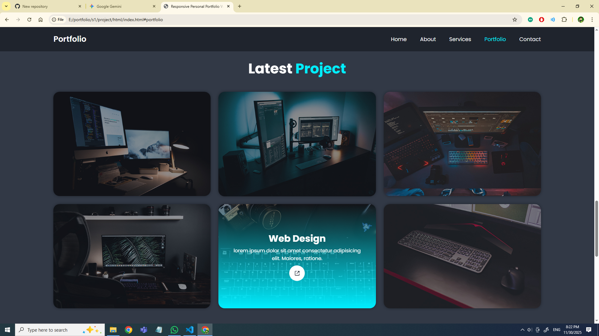
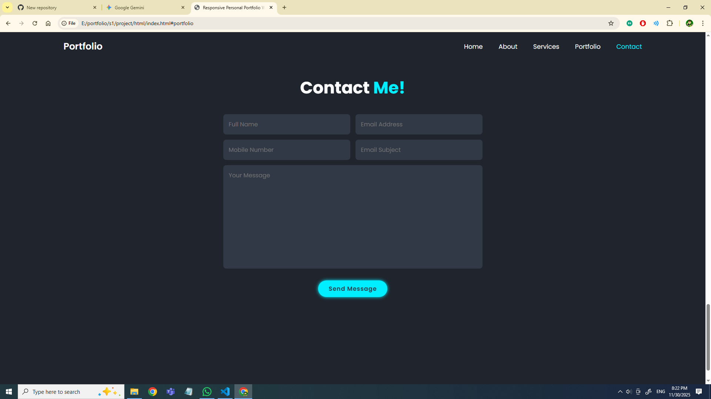

# 💻 Responsive Personal Portfolio

> A modern, responsive personal portfolio website built using HTML, CSS, and JavaScript. The site uses a sleek dark theme to effectively showcase skills, services, and the latest projects of a **Frontend Developer**.

## 🚀 Live Demo








## ✨ Key Features

* **Fully Responsive Design:** Optimized for all screen sizes, from mobile devices to desktop monitors.
* **Sleek Dark Mode Theme:** A clean, professional aesthetic to make content stand out.
* **Multi-Page Navigation:** Includes Home, About, Services, Portfolio, and Contact sections.
* **Showcase Sections:** Dedicated areas for **Services** (Web Development, Graphic Design, Digital Marketing) and a **Portfolio** gallery for the latest projects.
* **Contact Form Placeholder:** A non-functional contact form (since it's a pure front-end project) with a clear call-to-action.
* **Social Media Integration:** Links to popular platforms like Facebook, Twitter, and LinkedIn.

## 🛠️ Technology Stack

This project is a purely **Frontend** application.

* **HTML5:** For the fundamental structure of the website.
* **CSS3:** Used for styling, layout, and achieving the responsive design.
* **JavaScript:** For any client-side interactivity, such as menu toggles or scroll animations.

> **Note on Backend:** This project is designed purely for the front end. There is **no database**, **no server-side code (like Python or Node.js)**, and the contact form/buttons currently serve as **visual placeholders** and only **refresh the page** when clicked.

## ⚙️ How to Run Locally

1.  **Clone the repository:**
    ```bash
   git clone [https://github.com/AdamyoussefEg/responsive-personal-portfolio.git](https://github.com/AdamyoussefEg/responsive-personal-portfolio/edit/main/README.md)
    ```
2.  **Navigate to the project directory:**
    ```bash
    cd responsive-personal-portfolio
    ```
3.  **Open in your browser:**
    Simply open the `index.html` file in your preferred web browser (e.g., double-click it).

## 📄 License

This project is open-source and available under the [Choose your license, e.g., MIT License].
